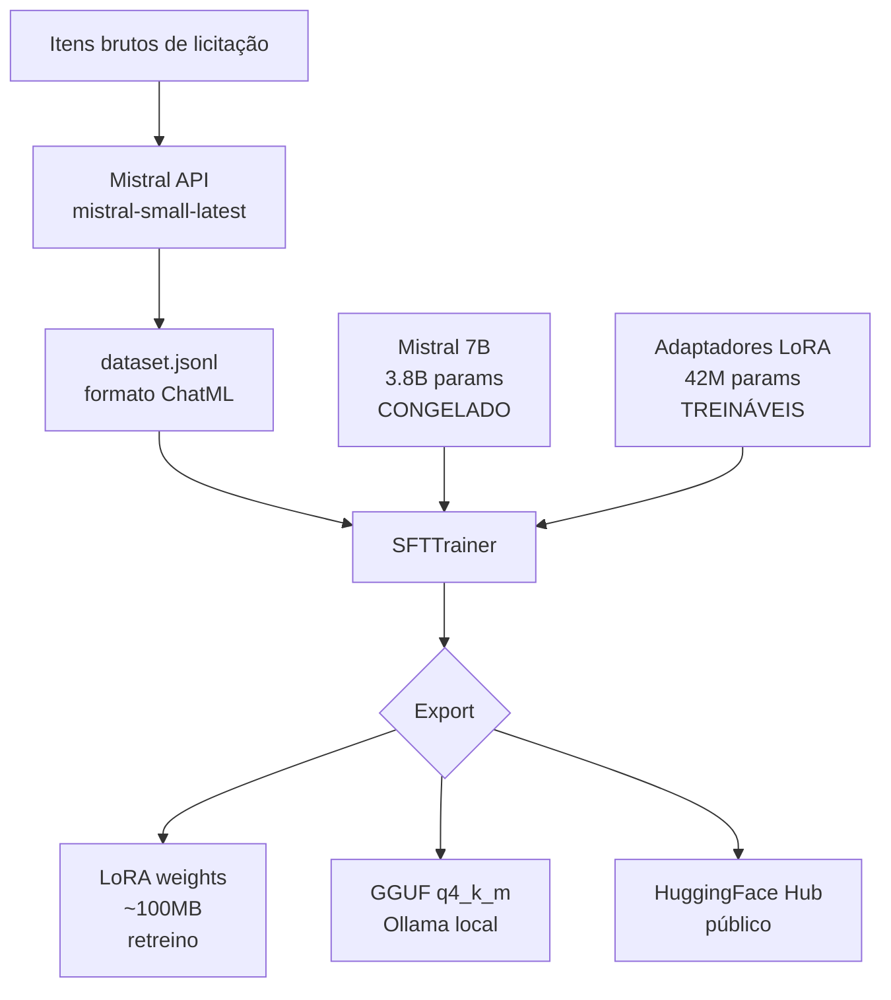
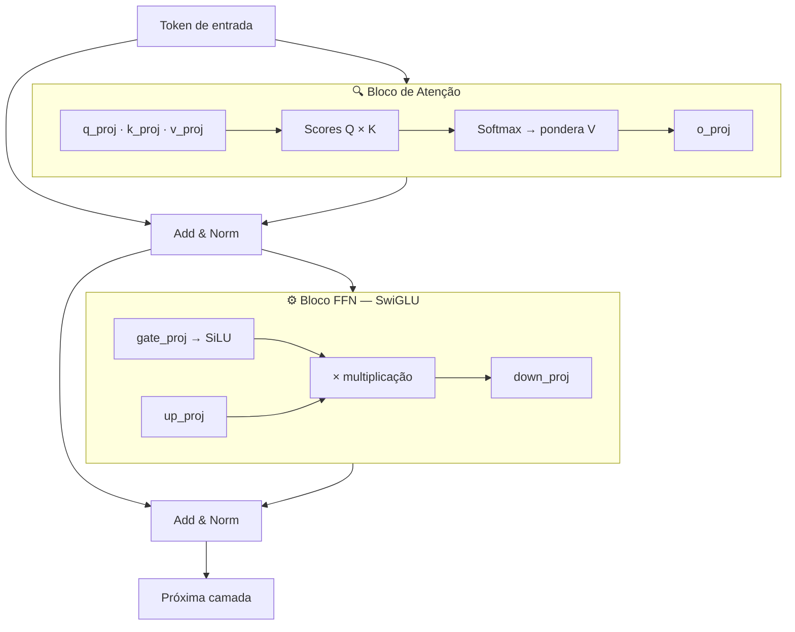
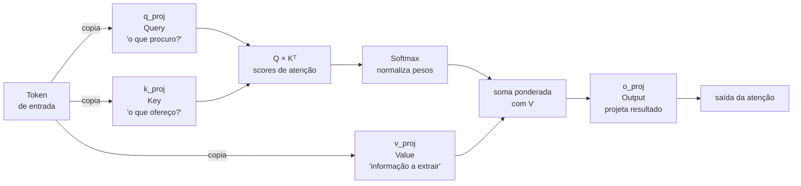
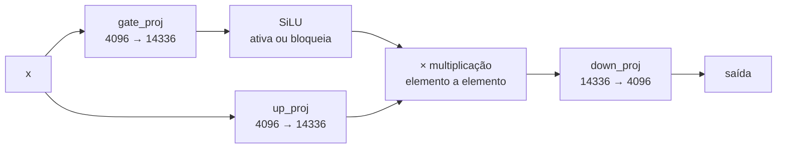
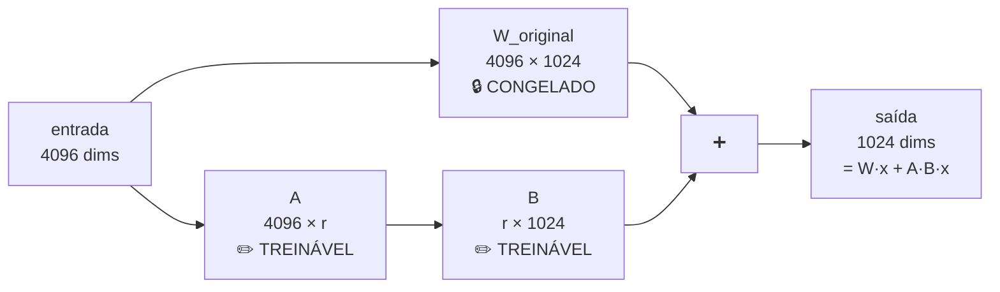
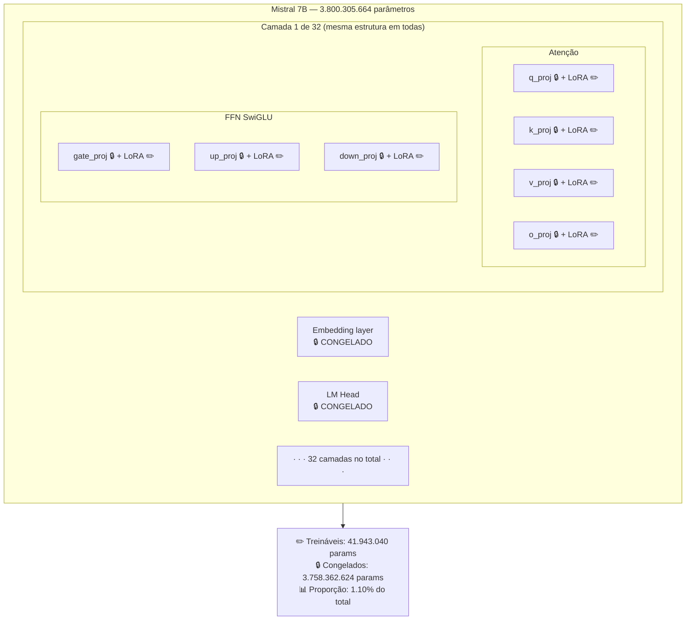

# LoRA Fine-tuning — Parâmetros e Arquitetura Explicados

## Pipeline completo do projeto



---

## Arquitetura de um Transformer (base de tudo)

Todo LLM moderno é uma pilha de **camadas repetidas**. Cada camada tem dois blocos principais:



O Mistral 7B tem **32 dessas camadas** empilhadas.

---

## Bloco de Atenção — o que é e por que importa

A atenção resolve: *"dado o token atual, quais outros tokens do contexto são relevantes?"*



**Por que incluir no LoRA?**
É aqui que o modelo aprende *relações semânticas*. Para o classificador de licitações, é a atenção que aprende que "contratação de empresa para..." tem padrão diferente de "aquisição de 500 unidades de...".

---

## Bloco FFN — o que é e por que importa

Depois da atenção, a FFN processa cada token **individualmente** — é onde ficam armazenados os "fatos" e padrões do modelo.

No Mistral usa arquitetura **SwiGLU** com 3 matrizes:



- `gate_proj` — decide *quais* features "abrir passagem"
- `up_proj` — expande a representação para espaço maior (4096 → 14336)
- `down_proj` — comprime de volta para a dimensão original (14336 → 4096)

**Por que incluir no LoRA?**
A FFN armazena conhecimento factual. Incluir essas camadas ensina ao modelo os padrões específicos do domínio — vocabulário jurídico de licitações, critérios da Lei 8.666/93, etc.

---

## Como o LoRA funciona na prática

Sem LoRA, para adaptar o modelo você teria que atualizar **cada uma** dessas matrizes enormes (ex: `q_proj` tem dimensão 4096×1024 = ~4M parâmetros).

O LoRA **não toca** os pesos originais. Em vez disso, insere dois adaptadores minúsculos em paralelo:



> Com `r=16`, as matrizes A e B juntas têm `4096×16 + 16×1024 = 82.432` parâmetros — contra os `4.194.304` da matriz original. **Redução de 98%.**

O resultado final é `W_original(x) + A×B(x)`. Só `A` e `B` são atualizados.

---

## Os parâmetros do notebook explicados

```python
model = FastLanguageModel.get_peft_model(
    model,
    r=16,
    lora_alpha=16,
    lora_dropout=0,
    target_modules=[
        "q_proj", "k_proj", "v_proj", "o_proj",
        "gate_proj", "up_proj", "down_proj",
    ],
    use_gradient_checkpointing="unsloth",
    bias="none",
    random_state=42,
)
```

### `r` — o mais importante

O rank controla o tamanho das matrizes `A` e `B`. Quanto maior, mais expressivo e mais memória.

| Valor | Parâmetros treináveis | Quando usar |
|---|---|---|
| `r=8` | ~20M | Dataset pequeno, tarefa simples |
| `r=16` | ~42M | **Equilíbrio geral (usado aqui)** |
| `r=32` | ~84M | Tarefa complexa, múltiplas classes |
| `r=64` | ~167M | Mudança de comportamento profunda |

### `lora_alpha` — a escala

Controla o quanto o adaptador influencia o modelo original. A fórmula aplicada é:

```
saída = W_original(x) + (alpha / r) × A×B(x)
```

Com `alpha=r=16`, o fator fica `16/16 = 1.0` — influência neutra, sem amplificar nem suprimir. É a configuração mais segura e mais comum.

### `lora_dropout`

Dropout aplicado nos adaptadores durante o treino para regularização. O Unsloth recomenda `0` porque já aplica outras otimizações internas que tornam o dropout redundante.

### `use_gradient_checkpointing="unsloth"`

Em vez de manter todos os gradientes na VRAM durante o backprop, recomputa os intermediários sob demanda. Economiza ~40% de VRAM no T4, permitindo usar `max_seq_length=2048` sem OOM.

### `bias="none"`

Não treina os vetores de bias — raramente necessário e economiza parâmetros.

### `target_modules` — onde inserir os adaptadores

```python
target_modules=[
    "q_proj", "k_proj", "v_proj", "o_proj",  # atenção (4 × 32 camadas)
    "gate_proj", "up_proj", "down_proj",       # FFN    (3 × 32 camadas)
]
```

Isso resulta em `7 módulos × 32 camadas = 224 pares de adaptadores (A, B)`.

**Por que não incluir tudo?** Camadas como embeddings e layer norms são mais sensíveis e raramente precisam ser ajustadas para fine-tuning de domínio.

---

## Parâmetros do SFTTrainer

```python
SFTConfig(
    num_train_epochs=3,
    per_device_train_batch_size=2,
    gradient_accumulation_steps=4,
    learning_rate=2e-4,
    warmup_steps=10,
    lr_scheduler_type="cosine",
    fp16=True,
    optim="adamw_8bit",
)
```

| Parâmetro | Valor | Motivo |
|---|---|---|
| `num_train_epochs` | 3 | Suficiente para datasets pequenos sem overfitting |
| `per_device_train_batch_size` | 2 | Limite da VRAM disponível no T4 |
| `gradient_accumulation_steps` | 4 | Batch efetivo = 2×4 = 8, sem gastar mais VRAM |
| `learning_rate` | 2e-4 | Padrão recomendado para LoRA |
| `warmup_steps` | 10 | Sobe o LR gradualmente nas primeiras steps |
| `lr_scheduler_type` | cosine | Decaimento suave até o fim do treino |
| `fp16` | True | T4 não tem suporte a bf16, usa fp16 |
| `optim` | adamw_8bit | Adam quantizado — mesma qualidade, menos VRAM |

**Batch efetivo:** o modelo nunca vê os 8 exemplos de uma vez. Ele processa 2 de cada vez e acumula os gradientes por 4 steps antes de atualizar os pesos. O efeito matemático é equivalente a um batch de 8.

---

## Resumo visual — o que é treinado



---

## Referências

- [LoRA: Low-Rank Adaptation of Large Language Models (paper original)](https://arxiv.org/abs/2106.09685)
- [Unsloth — documentação](https://docs.unsloth.ai)
- [TRL SFTTrainer](https://huggingface.co/docs/trl/sft_trainer)
- [Mistral 7B — arquitetura SwiGLU/GQA](https://arxiv.org/abs/2310.06825)
